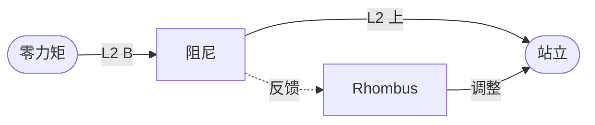

###  开机
所有短按长按开机，开机后等待

### 指示灯
蓝色等待，橙色阻尼，紫色零力矩

### 模式

```mermaid
graph LR
    A([零力矩]) -- L2 B --> B[阻尼]
    B -- L2 上 --> C([站立])
    B -. 反馈 .-> D[Rhombus]
    D -- 调整 --> C
```
<!--stackedit_data:
eyJoaXN0b3J5IjpbMjUyNzI0NDAxLC0yMDg4NzQ2NjEyXX0=
-->