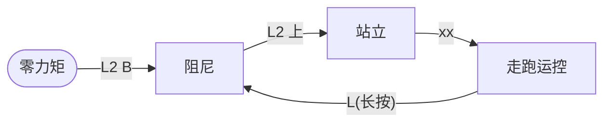

###  开机
所有短按长按开机，开机后等待自动进入零力矩

### 指示灯
蓝色等待，橙色阻尼，紫色零力矩

### 模式

```mermaid
graph LR
    A([零力矩]) -- L2 B --> B[阻尼]
    B -- L2 上 --> C[站立]
    D[走跑运控] -- "L(长按)" -->  B
    C -- xx --> D
```
<!--stackedit_data:
eyJoaXN0b3J5IjpbLTU5NzMwMzk5OSwtMjA4ODc0NjYxMl19
-->