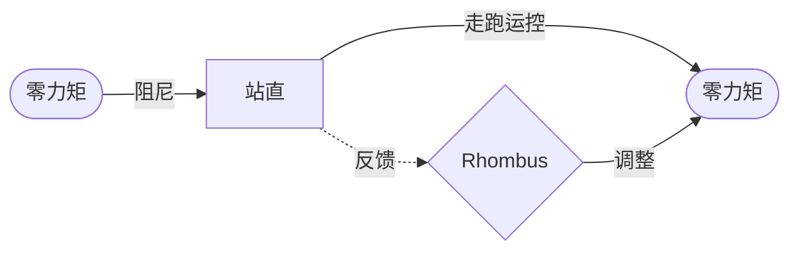

dau

```mermaid
graph LR
    A([零力矩]) -- 阻尼 --> B[站直]
    B -- 走跑运控 --> C([零力矩])
    B -. 反馈 .-> D{Rhombus}
    D -- 调整 --> C
```
<!--stackedit_data:
eyJoaXN0b3J5IjpbLTE0OTAzNTQ5MjAsLTIwODg3NDY2MTJdfQ
==
-->